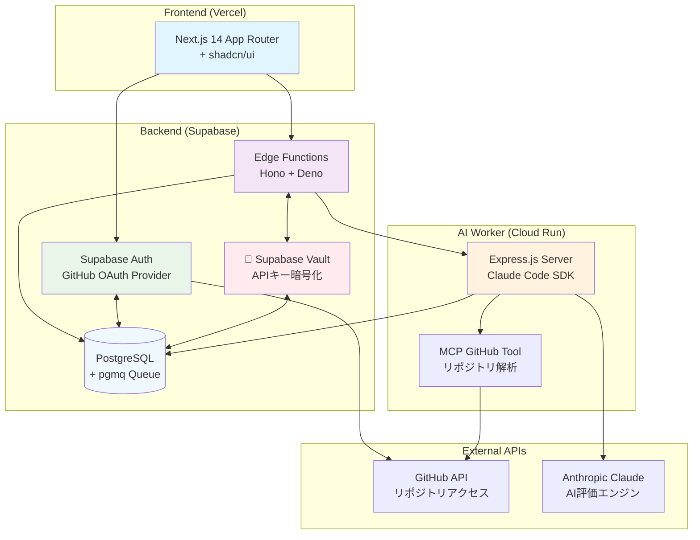
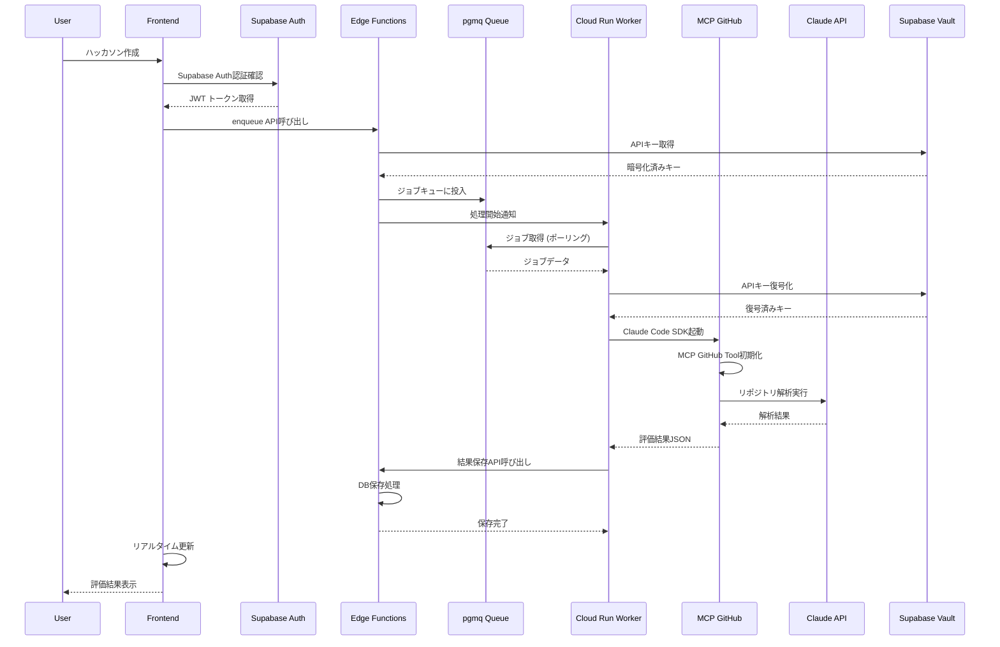
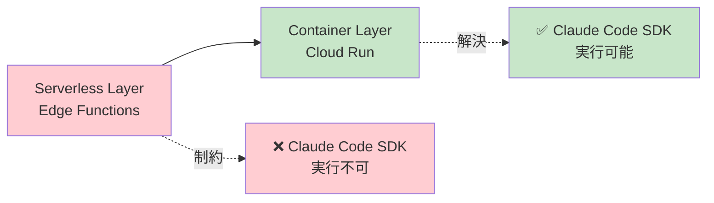

# HackScoreAI - AIエージェント開発の参考実装

GitHub リポジトリを**Claude Code SDK**で自動解析し、ハッカソン評価基準に基づくスコアを自動生成するプラットフォームです。

> **🤖 AIエージェント開発者の皆様へ**  
> このプロジェクトは、Claude Code SDKとMCPを活用した実用的なAIエージェントの参考実装です。サーバーレス環境での制約を克服し、安全なAPIキー管理を実現する設計パターンを学べます。

## 🏗️ システムアーキテクチャ

### 全体構成図


### システム構成の特徴

| 層 | 技術スタック | 役割 | AIエージェント開発での学習ポイント |
|---|---|---|---|
| **フロントエンド** | Next.js 14 + shadcn/ui | UI/UX | 🎯 ユーザーフレンドリーなAIツールUI設計 |
| **認証・データ層** | **Supabase統合プラットフォーム**<br/>Auth + PostgreSQL + Vault + Edge Functions | 認証、データ永続化、キュー、機密管理、API | 🔐 **統合プラットフォームによる開発効率化** |
| **AI処理層** | Cloud Run + Claude Code SDK | AIエージェント実行環境 | 🤖 **Claude Code SDKの実践的活用方法** |

### 処理フローシーケンス


## 🤖 AIエージェント開発者向け技術解説

### 1. 🎯 Claude Code SDKの汎用性と可能性

HackScoreAIで実証している**Claude Code SDKの活用パターン**は、あらゆるコード解析・生成タスクに応用可能です：

```javascript
// Cloud Run Worker での Claude Code SDK活用例
const { spawn } = require('child_process');

async function processRepositoryWithClaudeCode(repository, githubToken, evaluationCriteria) {
  // Claude Code SDK プロセスを起動
  const claudeProcess = spawn('claude-code', [
    '--api-key', anthropicKey,
    '--mcp-config', './mcp-config.json',
    'chat'
  ], {
    cwd: workDir,
    env: { 
      ...process.env, 
      GITHUB_TOKEN: githubToken  // MCP GitHub Tool用
    }
  });

  // ストリーミングで評価プロンプトを送信
  claudeProcess.stdin.write(evaluationPrompt);
  
  // JSON結果を解析して構造化データを取得
  const evaluationResult = await parseStreamingResponse(claudeProcess.stdout);
  
  return evaluationResult;
}
```

**活用例**：
- 📝 **コードレビュー自動化** - PR差分を解析してレビューコメント生成
- 🐛 **バグ検出エージェント** - セキュリティ脆弱性やパフォーマンス問題の特定
- 📚 **ドキュメント生成** - コードから技術仕様書の自動生成
- 🔄 **コード最適化** - リファクタリング提案の自動化

### 2. 🔧 MCP (Model Context Protocol) の威力

**MCPによる拡張性**がClaude Code SDKの真の価値です：

```json
// mcp-config.json - MCP設定例
{
  "mcpServers": {
    "github": {
      "command": "npx",
      "args": ["-y", "@modelcontextprotocol/server-github"],
      "env": {
        "GITHUB_PERSONAL_ACCESS_TOKEN": "{{GITHUB_TOKEN}}"
      }
    }
  }
}
```

**拡張可能なMCPツール**：
- 🗂️ **ファイルシステム操作** - ローカル/リモートファイルの読み書き
- 🌐 **Web API連携** - REST API、GraphQL、Webhook統合
- 🗃️ **データベース操作** - SQL実行、NoSQL操作
- ☁️ **クラウドサービス** - AWS、GCP、Azure統合

### 3. 🔐 Supabase Vaultによる安全なAPIキー管理

**企業レベルのセキュリティ**を個人開発でも実現：

```typescript
// APIキーの暗号化保存
export const vaultOperations = {
  async storeKey(userId: string, keyType: "anthropic_key" | "github_token", keyValue: string) {
    // Supabase Vault RPC関数で暗号化保存
    const { data, error } = await supabase.rpc("store_user_secret", {
      p_user_id: userId,
      p_secret_type: keyType,
      p_secret_name: "default",
      p_secret_value: keyValue, // 自動暗号化
    });
    return { success: !error, data };
  }
};
```

**セキュリティの利点**：
- 🔒 **自動暗号化** - AES-256暗号化での保存
- 👤 **ユーザー分離** - Row Level Security (RLS) による分離
- 🔑 **キー管理** - ローテーション、有効期限管理
- 📊 **監査ログ** - アクセス履歴の自動記録

### 4. ⚡ サーバーレス制約の解決パターン

**Claude Code SDKはサーバーレス環境で動作しない**制約を、アーキテクチャ分離で解決：



**実装パターン**：
```typescript
// Edge Function (サーバーレス層) - ジョブ管理のみ
export async function enqueue(req: Request) {
  // 1. リクエスト検証・認証
  // 2. pgmqキューにジョブ投入
  // 3. Cloud Run Workerに通知
}

// Cloud Run Worker (コンテナ層) - AI処理実行
export async function processJob(req: Request) {
  // 1. Claude Code SDK起動
  // 2. MCP連携でリポジトリ解析
  // 3. 結果をデータベースに保存
}
```

### 5. 🚀 最速AIエージェント開発スタック

**Next.js + Supabase統合プラットフォーム + Cloud Run** の組み合わせによる高速開発：

#### **Supabaseの統合力**
- **認証**: GitHub OAuth設定だけで本格認証システム完成
- **データベース**: PostgreSQL + リアルタイム機能 + pgmqキュー
- **API**: Edge Functions でサーバーレスAPI
- **セキュリティ**: Vault + RLS で企業レベル安全性
- **インフラ**: 全てマネージドで運用コスト最小

| フェーズ | 所要時間 | 成果物 |
|---------|----------|---------|
| **1日目** | UI実装 | Next.js + shadcn/ui でプロトタイプ |
| **2日目** | 認証・DB設計 | **Supabase統合設定**（Auth + PostgreSQL + Vault + Edge Functions） |
| **3日目** | AI処理実装 | Cloud Run + Claude Code SDK統合 |
| **4-5日目** | 本番デプロイ | Vercel + Supabase + GCP本番環境 |

**開発効率の秘密**：
- 🔄 **ホットリロード** - 全層でのリアルタイム開発
- 🧩 **型安全性** - TypeScript統合による品質確保
- 📦 **コンポーネント再利用** - shadcn/uiによるUI高速構築
- 🏗️ **Supabase統合** - 認証、DB、API、セキュリティが一体化
- ☁️ **マネージドサービス** - インフラ管理の最小化

## 📋 前提条件

- Node.js >= 18.0.0
- npm または yarn
- Docker Desktop
- GitHub アカウント
- Supabase CLI
- Google Cloud SDK (本番デプロイ時)

## 🚀 クイックスタート

### 1. 環境変数の設定

```bash
# フロントエンド環境変数
cp frontend/.env.example frontend/.env.local

# Cloud Run Worker環境変数
cp backend/cloud-run-worker/.env.example backend/cloud-run-worker/.env

# Supabase Edge Functions環境変数
cp backend/supabase/.env.example backend/supabase/.env
```

### 2. 開発環境起動

```bash
# 自動起動スクリプト（推奨）
./start_development.sh

# または手動起動
cd backend/supabase && supabase start
cd backend/supabase && supabase functions serve
cd backend/cloud-run-worker && npm install && npm run dev
cd frontend && npm install && npm run dev
```

### 3. 動作確認

- **フロントエンド**: http://localhost:3000
- **Supabase Studio**: http://127.0.0.1:54323
- **Cloud Run Worker**: http://localhost:8080/health
- **Edge Functions**: http://127.0.0.1:54321/functions/v1/

## 🔧 詳細セットアップ

### フロントエンド環境変数設定

`frontend/.env.local` に以下を設定：

```env
# GitHub OAuth設定（要事前作成）
GITHUB_CLIENT_ID=your-github-client-id
GITHUB_CLIENT_SECRET=your-github-client-secret

# Supabase設定
NEXT_PUBLIC_SUPABASE_URL=http://127.0.0.1:54321
NEXT_PUBLIC_SUPABASE_ANON_KEY=your-supabase-anon-key

# NextAuth設定
NEXTAUTH_URL=http://localhost:3000
NEXTAUTH_SECRET=your-nextauth-secret
```

### Cloud Run Worker設定

`backend/cloud-run-worker/.env` に以下を設定：

```env
# Supabase設定
SUPABASE_URL=http://localhost:54321
SUPABASE_SERVICE_ROLE_KEY=your-service-role-key

# 認証設定
CLOUD_RUN_AUTH_TOKEN=your-secure-auth-token

# Vault設定
VAULT_SECRET_KEY=your-vault-encryption-key

# Claude Code SDK設定
MAX_TURNS_PER_ANALYSIS=50
ANALYSIS_TIMEOUT_MS=300000
```

### Supabase Edge Functions設定

`backend/supabase/.env` に以下を設定：

```env
# Cloud Run Worker統合
CLOUD_RUN_WORKER_URL=http://host.docker.internal:8080
CLOUD_RUN_AUTH_TOKEN=your-secure-auth-token

# GitHub OAuth設定
GITHUB_CLIENT_ID=your-github-client-id
GITHUB_CLIENT_SECRET=your-github-client-secret

# Vault暗号化キー（32文字）
VAULT_SECRET_KEY=your-vault-secret-key-32-chars-long
```

### GitHub OAuth App作成

1. [GitHub Developer Settings](https://github.com/settings/developers) にアクセス
2. "New OAuth App" をクリック
3. 以下の設定で作成：
   - Application name: HackScore AI
   - Homepage URL: `http://localhost:3000`
   - Authorization callback URL: `http://localhost:3000/auth/callback`

## 🔐 APIキー設定

運用には以下のAPIキーが必要です：

1. **Anthropic API Key**: Claude Code SDK利用に必要
2. **GitHub Personal Access Token**: プライベートリポジトリアクセス用

設定ページ (http://localhost:3000/settings) から安全に登録できます。

## 📁 プロジェクト構造

```
HackScoreAI/
├── frontend/                    # Next.js 14 App Router アプリ
│   ├── src/app/                # ページルーティング
│   ├── src/components/         # 再利用可能UIコンポーネント
│   ├── src/lib/               # Supabaseクライアント、認証ユーティリティ
│   ├── src/types/             # TypeScript型定義
│   └── .env.example           # フロントエンド環境変数テンプレート
├── backend/
│   ├── supabase/               # Supabase プロジェクト設定
│   │   ├── functions/          # Edge Functions (Deno + Hono)
│   │   ├── migrations/         # データベースマイグレーション
│   │   ├── config.toml        # Supabase設定
│   │   └── .env.example       # Edge Functions環境変数
│   └── cloud-run-worker/       # Claude Code SDK実行環境
│       ├── src/index.js       # Express.js + Claude Code SDK
│       ├── mcp-config.json    # MCP設定
│       └── .env.example       # Worker環境変数
├── scripts/                    # 開発・デプロイスクリプト
└── README.md                   # このファイル
```

## 🧪 テスト実行

### バックエンドテスト
```bash
cd backend/cloud-run-worker

# キュー処理テスト
node test-queue.js

# Vault暗号化テスト  
node test-vault.js

# Claude Code SDK統合テスト
node test-full-pipeline.js --confirm
```

### フロントエンドテスト
```bash
cd frontend

# ESLintチェック
npm run lint

# TypeScriptビルドテスト
npm run build

# 本番プレビュー
npm run start
```

## 🚀 本番デプロイ

### フロントエンド (Vercel)
```bash
vercel --prod
```

### バックエンド (Supabase + Cloud Run)
```bash
# Supabase本番環境デプロイ
supabase db push
supabase functions deploy

# Cloud Run Workerデプロイ  
cd backend/cloud-run-worker
./scripts/deploy.sh
```

## 🐛 トラブルシューティング

### よくある問題と解決方法

#### 1. ポート競合エラー
```bash
# ポート使用状況確認
lsof -i :3000 :54321 :8080

# 競合プロセス終了
kill -9 <PID>
```

#### 2. Supabase接続エラー
```bash
# ステータス確認
supabase status

# 再起動
supabase stop && supabase start
```

#### 3. Claude Code SDK実行エラー
```bash
# Workerログ確認
curl http://localhost:8080/health

# MCP設定確認
cat backend/cloud-run-worker/mcp-config.json
```

#### 4. Edge Functions デバッグ
```bash
# デバッグモードで起動
supabase functions serve --debug

# 個別Function テスト
supabase functions invoke enqueue --data '{"test": true}'
```

## 🤝 コントリビューション

このプロジェクトはAIエージェント開発の学習リソースとして公開されています。

### 改善提案歓迎
- 🐛 バグ報告・修正
- 🚀 パフォーマンス最適化
- 📚 ドキュメント改善
- 🔧 新機能の提案

### 学習目的での活用
- 🎓 Claude Code SDK の実装パターン学習
- 🏗️ スケーラブルなAIエージェントアーキテクチャの参考
- 🔐 セキュアなAPIキー管理の実装例
- ⚡ サーバーレス制約の回避パターン

## 📞 サポート・質問

技術的な質問やAIエージェント開発に関する相談は、GitHubのIssuesからお気軽にどうぞ。

---

> **🎯 このプロジェクトを通じて学べること**  
> - Claude Code SDKを活用した実用的なAIエージェント開発  
> - MCPによる拡張可能なエージェント設計  
> - 企業レベルのセキュリティを備えた個人開発  
> - モダンな技術スタックでの高速プロトタイピング

**Happy Coding! 🚀**