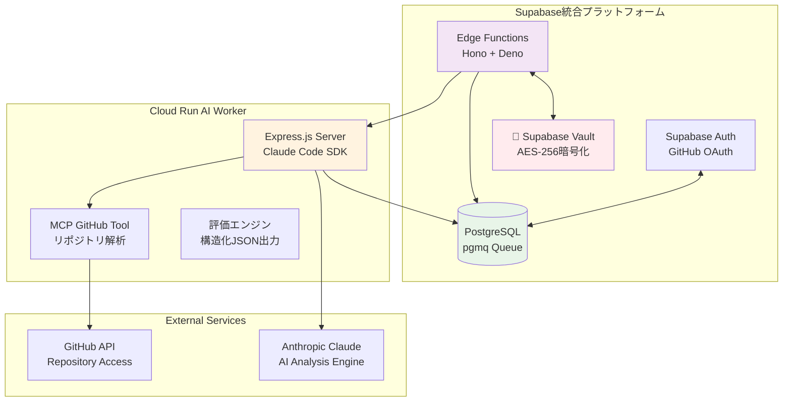
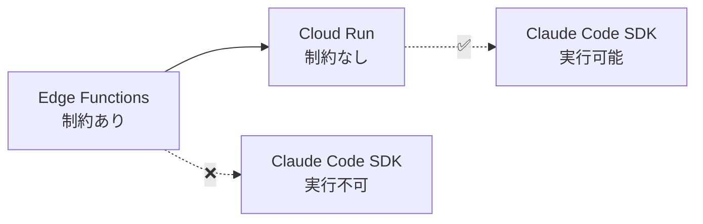

# HackScore AI Backend - Supabase統合プラットフォーム + Cloud Run Worker

GitHub リポジトリを**Claude Code SDK**で自動解析し、ハッカソン評価基準に基づくスコアを自動生成するバックエンドシステム。

> **🤖 AIエージェント開発者向け学習ポイント**  
> このバックエンドは、サーバーレス制約を克服した**Claude Code SDK統合パターン**、**Supabase統合プラットフォーム**活用、**安全なAPIキー管理**の実装を学べます。

## 🏗️ アーキテクチャ概要



## 🚀 技術スタック・構成

| 層 | 技術 | 役割 | AIエージェント開発での学習価値 |
|---|---|---|---|
| **API・認証** | Supabase Edge Functions (Hono + Deno) | RESTful API、ジョブ管理、認証 | 🚀 サーバーレスAPI設計パターン |
| **データ・キュー** | PostgreSQL + pgmq + Vault | データ永続化、非同期処理、暗号化 | 📊 スケーラブルなデータ管理 |
| **AI処理** | Cloud Run + Claude Code SDK + MCP | AIエージェント実行環境 | 🤖 **Claude Code SDK実装パターン** |
| **セキュリティ** | Supabase Vault + RLS | APIキー暗号化、アクセス制御 | 🔐 **企業レベルセキュリティ** |

## 📁 プロジェクト構造

```
backend/
├── supabase/                   # Supabase統合プラットフォーム
│   ├── functions/              # Edge Functions (Deno + Hono)
│   │   ├── enqueue/           # 🎯 ジョブキュー投入
│   │   ├── repo_worker/       # 👷 ジョブ処理ワーカー
│   │   ├── add-repository/    # ➕ リポジトリ追加
│   │   ├── delete-hackathon/  # 🗑️ ハッカソン削除
│   │   ├── remove-repository/ # ➖ リポジトリ削除
│   │   ├── retry-repository/  # 🔄 リトライ処理
│   │   └── vault_test/       # 🔐 Vault機能テスト
│   ├── migrations/            # データベーススキーマ
│   ├── config.toml           # Supabase設定
│   └── .env.example          # Edge Functions環境変数
├── cloud-run-worker/          # Claude Code SDK実行環境
│   ├── src/index.js          # Express.js + Claude Code SDK
│   ├── mcp-config.json       # MCP設定 (GitHub Tool)
│   ├── Dockerfile            # Container定義
│   └── .env.example          # Worker環境変数
└── README.md                 # このファイル
```

## 🔧 主要コンポーネント

### 1. 🎯 Edge Functions (Supabase)

#### **enqueue** - ジョブキュー投入
```typescript
// ハッカソン評価ジョブをpgmqキューに投入
const { data, error } = await supabase.functions.invoke("enqueue", {
  body: {
    repositories: ["user/repo1", "user/repo2"],
    userId: "user-uuid",
    evaluationCriteria: { hackathonName: "AI Contest 2024" }
  }
});
```
**学習ポイント**:
- CORS対応パターン
- JWT認証統合
- pgmqキューシステム活用

#### **repo_worker** - ジョブ処理ワーカー
```typescript
// pgmqからジョブを取得してCloud Run Workerに転送
const jobs = await supabase.rpc('get_pending_jobs');
// Cloud Run Workerに処理依頼
await fetch(cloudRunUrl + '/process', { body: jobData });
```
**学習ポイント**:
- ポーリング型ワーカーパターン
- 外部サービス連携
- 失敗時フォールバック処理

### 2. 🤖 Cloud Run Worker (Claude Code SDK実行環境)

#### **Express.js + Claude Code SDK統合**
```javascript
// Claude Code SDKプロセスの起動と管理
const claudeProcess = spawn('claude-code', [
  '--api-key', anthropicKey,
  '--mcp-config', './mcp-config.json',
  'chat'
], {
  env: { GITHUB_TOKEN: githubToken }
});

// MCP GitHub Toolによるリポジトリ解析
claudeProcess.stdin.write(`
GitHub repository ${repository} を解析し、以下の評価基準でハッカソンスコアを生成してください：
...
`);
```

**学習ポイント**:
- **サーバーレス制約の回避**: Edge Functionsで不可能なClaude Code SDK実行
- **MCP統合**: GitHub Tool活用による外部サービス連携
- **ストリーミング処理**: AIからのレスポンス解析パターン

### 3. 🔐 Supabase Vault (安全なAPIキー管理)

#### **暗号化保存・復号化**
```sql
-- AES-256暗号化によるAPIキー保存
CREATE OR REPLACE FUNCTION store_user_secret(
  p_user_id UUID,
  p_secret_type TEXT,
  p_secret_name TEXT,
  p_secret_value TEXT
) RETURNS JSON AS $$
BEGIN
  INSERT INTO user_secrets (user_id, secret_type, secret_name, encrypted_secret)
  VALUES (p_user_id, p_secret_type, p_secret_name, 
         pgp_sym_encrypt(p_secret_value, get_vault_key()));
END;
$$ LANGUAGE plpgsql;
```

**学習ポイント**:
- **企業レベル暗号化**: AES-256による機密情報保護
- **ユーザー分離**: Row Level Security (RLS) 活用
- **統合アクセス**: Edge FunctionsからのシームレスなVault操作

### 4. 📊 データベーススキーマ

#### **主要テーブル**
```sql
-- ハッカソン管理
CREATE TABLE hackathons (
  id UUID PRIMARY KEY,
  name VARCHAR(255),
  user_id UUID,
  status VARCHAR(50), -- pending, analyzing, completed, failed
  total_repositories INTEGER,
  completed_repositories INTEGER,
  average_score NUMERIC(5,2)
);

-- ジョブ管理
CREATE TABLE job_status (
  id UUID PRIMARY KEY,
  hackathon_id UUID,
  status VARCHAR(50), -- pending, processing, completed, failed
  payload JSONB,
  result JSONB
);

-- 評価結果
CREATE TABLE evaluation_results (
  id UUID PRIMARY KEY,
  hackathon_id UUID,
  repository_name VARCHAR(255),
  total_score INTEGER,
  evaluation_data JSONB,
  processing_metadata JSONB -- Claude Code SDKのコスト情報等
);
```

## 🛠️ セットアップ

### 1. Supabase環境起動

```bash
cd backend/supabase

# 環境変数設定
cp .env.example .env
# 編集: VAULT_SECRET_KEY, CLOUD_RUN_AUTH_TOKEN等

# Supabaseローカル環境起動
supabase start

# Edge Functions起動
supabase functions serve
```

### 2. Cloud Run Worker起動

```bash
cd backend/cloud-run-worker

# 環境変数設定
cp .env.example .env
# 編集: SUPABASE_URL, ANTHROPIC_API_KEY等

# 依存関係インストール・起動
npm install
npm run dev
```

### 3. 動作確認

```bash
# 🧪 キューシステムテスト
node test-queue.js

# 🔐 Vault暗号化テスト
node test-vault.js

# 🤖 Claude Code SDK統合テスト (APIキー要設定)
node test-full-pipeline.js --confirm
```

## 🧪 主要テストシナリオ

### 1. **pgmqキューシステム**
- ジョブ投入 → キュー格納 → ワーカー取得 → 処理完了
- 失敗時のリトライ機能
- 同時実行制御

### 2. **Supabase Vault暗号化**
- APIキー暗号化保存
- ユーザー別アクセス制御
- Edge Functionsからの安全な取得

### 3. **Claude Code SDK統合**
- GitHub MCP Toolによるリポジトリ解析
- AIによるハッカソン評価基準での採点
- 構造化JSONレスポンスの解析

### 4. **完全パイプライン**
- フロントエンド → Edge Functions → Cloud Run → AI解析 → 結果保存

## 🚀 本番デプロイ

### Supabase
```bash
# データベースマイグレーション
supabase db push

# Edge Functions デプロイ
supabase functions deploy enqueue
supabase functions deploy repo_worker
# ... 他のFunctionsも同様
```

### Cloud Run Worker
```bash
cd backend/cloud-run-worker

# Docker ビルド・デプロイ
./scripts/deploy.sh

# または手動デプロイ
gcloud run deploy hackscore-worker \
  --source . \
  --platform managed \
  --region us-central1
```

## 🎓 AIエージェント開発での学習価値

### 1. **サーバーレス制約の解決パターン**

- **問題**: Edge FunctionsではClaude Code SDK実行不可
- **解決**: アーキテクチャ分離によるハイブリッド構成

### 2. **Supabase統合プラットフォーム活用**
- **認証**: GitHub OAuth統合
- **データベース**: PostgreSQL + リアルタイム機能
- **API**: Edge Functions (Deno + Hono)
- **セキュリティ**: Vault + RLS
- **キュー**: pgmq による非同期処理

### 3. **企業レベルセキュリティパターン**
- AES-256暗号化による機密情報保護
- Row Level Security (RLS) によるデータ分離
- JWT認証によるAPI保護
- 監査ログによる操作追跡

### 4. **MCP (Model Context Protocol) 活用**
- GitHub Tool統合による外部サービス連携
- 拡張可能なツールエコシステム
- AI能力の動的拡張パターン

---

> **💡 このバックエンドから学べること**  
> サーバーレス制約の解決方法、Supabase統合プラットフォーム活用、Claude Code SDK実践パターン、企業レベルセキュリティ実装

**Happy Coding! 🚀**