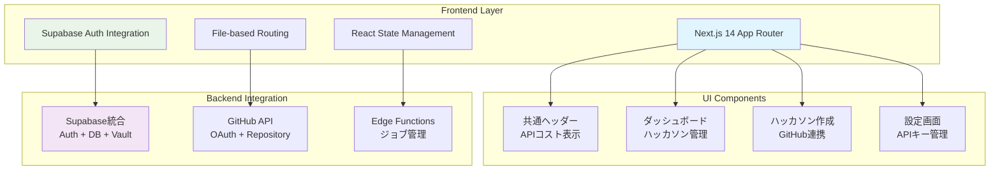

# HackScore AI Frontend - Next.js 14 App Router アプリケーション

GitHub リポジトリを自動評価するAIプラットフォームのフロントエンド。**Claude Code SDK**との統合により、ハッカソン評価を自動化します。

> **🎯 AIエージェント開発者向け学習ポイント**  
> このフロントエンドは、AI処理を伴うWebアプリケーションのモダンな設計パターンを示します。Supabase統合認証、リアルタイム状態管理、ユーザーフレンドリーなAIツールUIの実装を学べます。

## 🏗️ アーキテクチャ概要



## 🚀 技術スタック

| カテゴリ | 技術 | 選択理由 | AIエージェント開発での学習価値 |
|---------|------|----------|----------------------------|
| **フレームワーク** | Next.js 14 (App Router) | SSR/SSG、ファイルベースルーティング | 🚀 モダンなWebアプリ開発手法 |
| **UI** | shadcn/ui + Tailwind CSS | 高品質コンポーネント、高速開発 | 🎨 プロフェッショナルなUI設計 |
| **認証** | Supabase Auth (GitHub OAuth) | 統合認証、セキュリティ | 🔐 企業レベル認証システム |
| **状態管理** | React Hooks + Context | シンプル、型安全 | 📊 効率的な状態管理パターン |
| **型安全性** | TypeScript | 開発効率、品質向上 | 🛡️ 堅牢なアプリケーション設計 |

## 📁 プロジェクト構造

```
frontend/
├── src/
│   ├── app/                    # Next.js App Router
│   │   ├── dashboard/         # 📊 ダッシュボード - ハッカソン管理
│   │   ├── hackathon/         # 🏗️ ハッカソン作成・詳細
│   │   │   ├── new/          # 新規作成フォーム
│   │   │   └── [id]/         # 詳細・結果表示
│   │   ├── settings/          # ⚙️ 設定 - APIキー管理
│   │   ├── login/             # 🔐 ログイン
│   │   └── providers.tsx      # React Context プロバイダー
│   ├── components/            # 🧩 再利用可能コンポーネント
│   │   ├── common-header.tsx  # 共通ヘッダー (APIコスト表示付き)
│   │   ├── ui/               # shadcn/ui コンポーネント
│   │   ├── octocat-character.tsx # マスコットキャラクター
│   │   └── binary-background.tsx # 背景エフェクト
│   ├── lib/                   # 📚 ライブラリ・ユーティリティ
│   │   ├── supabase.ts       # Supabase操作 (Vault, Auth, DB)
│   │   ├── auth.ts           # 認証ヘルパー
│   │   └── utils.ts          # 汎用ユーティリティ
│   └── types/                 # 🏷️ TypeScript型定義
│       └── evaluation.ts     # 評価結果・ハッカソン型
├── public/                    # 静的アセット
├── .env.example              # 環境変数テンプレート
└── package.json              # 依存関係・スクリプト
```

## 🛠️ セットアップ

### 1. 依存関係のインストール

```bash
npm install
```

### 2. 環境変数の設定

`.env.local` ファイルを作成：

```env
# Supabase 設定
NEXT_PUBLIC_SUPABASE_URL=http://127.0.0.1:54321
NEXT_PUBLIC_SUPABASE_ANON_KEY=your-supabase-anon-key

# GitHub OAuth 設定 (要事前作成)
GITHUB_CLIENT_ID=your-github-client-id
GITHUB_CLIENT_SECRET=your-github-client-secret

# NextAuth.js 設定
NEXTAUTH_URL=http://localhost:3000
NEXTAUTH_SECRET=your-nextauth-secret
```

### 3. GitHub OAuth App作成

1. [GitHub Developer Settings](https://github.com/settings/developers) → "New OAuth App"
2. 設定：
   - **Application name**: HackScore AI
   - **Homepage URL**: `http://localhost:3000`
   - **Authorization callback URL**: `http://localhost:3000/auth/callback`

### 4. 開発サーバー起動

```bash
npm run dev
```

ブラウザで http://localhost:3000 にアクセス

## 🎨 UI/UXデザインシステム

### テーマカラー
- **Primary**: `hsl(142, 100%, 50%)` - ハッカー風グリーン
- **Background**: `hsl(0, 0%, 4%)` - ダークモード対応
- **Card**: `hsl(0, 0%, 9%)` - コンテンツカード
- **Border**: `hsl(0, 0%, 15%)` - 境界線

### キャラクターデザイン
- **8bit Octocat**: プログラミング文化に親しみやすいマスコット
- **アニメーション**: 瞬き、コード文字流れ、処理状態表示

### レスポンシブ対応
- **モバイルファースト**: Tailwind CSS のブレークポイント活用
- **タッチインターフェース**: スマートフォンでの操作を考慮

## 📱 主要機能・コンポーネント

### 1. 🔐 認証システム (`providers.tsx`, `lib/auth.ts`)
```typescript
// Supabase Auth統合による堅牢な認証
const { user, session, loading, signOut } = useAuth();
```
**学習ポイント**: 
- GitHub OAuth統合パターン
- セッション管理とリアルタイム状態更新
- 認証状態に基づくページ保護

### 2. 📊 ダッシュボード (`app/dashboard/page.tsx`)
```typescript
// リアルタイム更新対応のハッカソン管理
useEffect(() => {
  const handleFocus = () => loadHackathons();
  window.addEventListener('focus', handleFocus);
}, []);
```
**学習ポイント**:
- データのリアルタイム同期パターン
- 非同期処理状態の視覚化
- ユーザビリティを重視したUX設計

### 3. 🏗️ ハッカソン作成 (`app/hackathon/new/page.tsx`)
```typescript
// GitHub APIとSupabase Vault統合
const accessToken = githubTokenResult.success 
  ? githubTokenResult.data 
  : session.provider_token;
```
**学習ポイント**:
- 外部API連携パターン (GitHub API)
- セキュアなAPIキー管理
- 段階的フォームUI設計

### 4. ⚙️ 設定管理 (`app/settings/page.tsx`)
```typescript
// Supabase Vault による暗号化保存
await vaultOperations.storeKey(userId, "anthropic_key", keyValue);
```
**学習ポイント**:
- 機密情報の安全な管理パターン
- ユーザー体験を損なわないセキュリティ設計

### 5. 🧩 共通ヘッダー (`components/common-header.tsx`)
```typescript
// APIコスト表示による透明性確保
const [totalCost, setTotalCost] = useState<number | null>(null);
```
**学習ポイント**:
- AI処理コストの可視化
- コンポーネント再利用設計
- プロップス vs Context の使い分け

## 🔗 バックエンド統合

### Supabase統合プラットフォーム活用
```typescript
// 統合されたSupabaseクライアント操作
export const { hackathonOperations, vaultOperations } = supabase;
```

**統合される機能**:
- **認証**: GitHub OAuth経由のSupabase Auth
- **データベース**: PostgreSQL + リアルタイム機能
- **ストレージ**: Supabase Vault での暗号化保存
- **API**: Edge Functions によるサーバーレス処理

### GitHub API連携
```typescript
// OAuth Token vs Personal Access Token の使い分け
const accessToken = vaultKey || session.provider_token;
```

## 🧪 開発・テスト

### 品質チェック
```bash
# ESLint チェック
npm run lint

# TypeScript ビルドテスト
npm run build

# 本番プレビュー
npm run start
```

### デバッグ機能
- **リアルタイム状態表示**: 認証状態、API通信状況
- **コンソールログ**: 詳細な処理フロー記録
- **エラーハンドリング**: ユーザーフレンドリーなエラー表示

## 🚀 本番デプロイ (Vercel)

### 1. 環境変数設定
```env
NEXTAUTH_URL=https://your-domain.vercel.app
NEXT_PUBLIC_SUPABASE_URL=https://your-project.supabase.co
# その他本番用設定...
```

### 2. GitHub OAuth更新
- Homepage URL: 本番ドメイン
- Callback URL: `https://your-domain.vercel.app/auth/callback`

### 3. 自動デプロイ
```bash
# Vercel CLI使用
vercel --prod

# または GitHub連携による自動デプロイ
```

## 🎓 AIエージェント開発での学習価値

### 1. **ユーザーセントリックAIツール設計**
- AI処理の進行状況を直感的に表示
- 複雑な技術を分かりやすいUIで提供
- エラー状況での適切なガイダンス

### 2. **モダン認証統合パターン**
- OAuth2.0 + JWT の実装
- 外部サービス認証の統合方法
- セキュリティとUXのバランス

### 3. **リアルタイム状態管理**
- 長時間処理の進行状況管理
- バックグラウンド処理との連携
- ユーザビリティを重視した状態設計

### 4. **型安全な開発フロー**
- TypeScript による堅牢な設計
- コンポーネント間の型安全な連携
- 外部API統合での型管理

---

> **💡 このフロントエンドから学べること**  
> モダンなAIツールUIの設計パターン、Supabase統合による高速開発、ユーザーフレンドリーな認証フロー、リアルタイム状態管理の実装方法

**Happy Coding! 🚀**